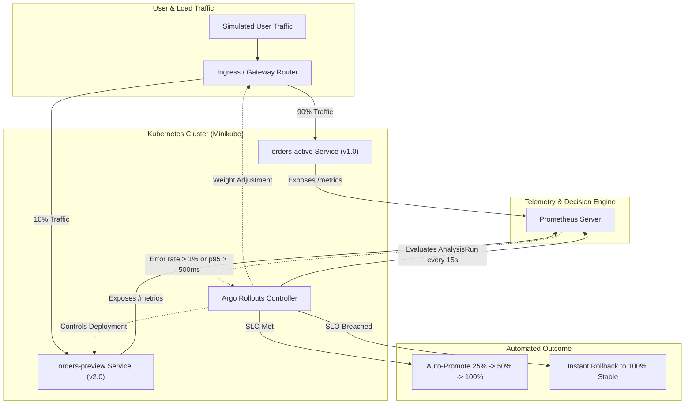

# SRE Progressive Canary: SLO-Driven Delivery with Automatic Rollback

[](https://kubernetes.io/)
[](https://argoproj.github.io/argo-rollouts/)
[](https://prometheus.io/)

A hands-on reference implementation of **progressive canary delivery with automatic, SLO-based rollback**.

A FastAPI orders service exports Golden Signal metrics to Prometheus. Argo Rollouts releases new versions gradually, and an `AnalysisTemplate` checks the canary's error rate and p95 latency at every step. If the canary breaches the SLO, the rollout aborts and traffic returns to the stable version with no human intervention, typically within about 30-45 seconds of the first bad measurements.

It runs on Minikube, including Google Cloud Shell, so no paid cloud cluster is needed.

---

## Architecture Overview



---

## Core Reliability Engineering Concepts

### 1. Progressive Canary Strategy
Instead of replacing all pods at once, traffic shifts in steps:
* **Step 1:** 10% canary traffic + 30s pause
* **Analysis:** `canary-slo-burn-check` queries Prometheus
* **Step 2:** 25% canary traffic
* **Step 3:** 50% canary traffic
* **Step 4:** 100% promotion to stable

Weighted traffic splitting requires `trafficRouting` (NGINX ingress in this repo). Without it, Argo Rollouts approximates weights by replica count.

### 2. Error Budget Model
Based on the [Google SRE Workbook](https://sre.google/workbook/alerting-on-slos/):

$$\text{Burn Rate} = \frac{\text{Observed Error Rate}}{\text{Error Budget}}$$

* **Availability SLO:** 99.0% success (error budget: 1.0%)
* **Canary gate:** a single threshold. Error rate above 1% (burn rate above 1.0) or p95 latency above 500 ms fails a measurement.
* **Not included:** multi-burn-rate alerting (for example fast burn 14.4x, slow burn 6x). It is a natural extension, since the canary gate uses a single threshold.

The threshold is evaluated in the `successCondition`, **not** inside PromQL. Appending `<= 0.01` to the query would filter the series out exactly when the SLO is breached and return an empty result.

```yaml
metrics:
  - name: error-rate
    interval: 15s
    count: 8
    failureLimit: 1            # rollout aborts when failures exceed 1 (2nd failure)
    successCondition: len(result) == 0 || result[0] <= 0.01
    provider:
      prometheus:
        query: |
          sum(rate(http_requests_total{status=~"5..", version="{{args.canary-version}}"}[1m]))
          /
          sum(rate(http_requests_total{version="{{args.canary-version}}"}[1m]))
  - name: p95-latency
    interval: 15s
    count: 8
    failureLimit: 1
    successCondition: len(result) == 0 || result[0] <= 0.5
    provider:
      prometheus:
        query: |
          histogram_quantile(0.95,
            sum(rate(http_request_duration_seconds_bucket{version="{{args.canary-version}}"}[1m])) by (le))
```

An empty result means the canary has received no traffic yet and is treated as a pass. Generate load before judging a rollout.

`failureLimit: 1` means the analysis fails on the **second** failed measurement (not the first), which filters one-off blips. At a 15s interval, that is roughly 30 seconds of sustained breach.

---

## Repository Structure

```
sre-progressive-canary/
├── app/
│   ├── main.py                 # FastAPI microservice with /metrics & fault injection API
│   └── Dockerfile              # Multi-stage, non-root container (accepts APP_VERSION build arg)
├── k8s/
│   ├── rollout.yaml            # Argo Rollout with canary steps & analysis binding
│   ├── services.yaml           # Active (Stable) and Preview (Canary) services
│   ├── analysis-template.yaml  # PromQL SLO error-rate & p95 latency rules
│   └── ingress.yaml            # Ingress traffic splitter
├── traffic/
│   └── simulate_traffic.py     # Traffic generator and fault injection CLI
├── tests/
│   └── test_main.py            # Unit and fault injection tests
├── cloud-shell-setup.sh        # Minikube setup for Google Cloud Shell
├── requirements.txt            # Runtime dependencies
└── requirements-dev.txt        # Runtime + test dependencies
```

---

## Quickstart

### 1. Test Locally
```bash
python -m venv .venv
.venv\Scripts\activate        # Windows
# source .venv/bin/activate   # Linux/macOS

pip install -r requirements-dev.txt
python -m pytest tests/
```

### 2. Run the Microservice Locally
```bash
uvicorn app.main:app --port 8080 --reload
```
* Health probe: `http://localhost:8080/healthz`
* Prometheus metrics: `http://localhost:8080/metrics`
* Orders endpoint: `http://localhost:8080/api/v1/orders`

### 3. Simulate Chaos
```bash
# Terminal 1: generate live traffic
python traffic/simulate_traffic.py --action traffic --rps 15 --duration 60

# Terminal 2: inject a 30% error rate and 0.8s latency
python traffic/simulate_traffic.py --action fault --error-rate 0.30 --latency 0.80

# Reset
python traffic/simulate_traffic.py --action reset
```

### 4. Run on Minikube / Google Cloud Shell
```bash
chmod +x cloud-shell-setup.sh
./cloud-shell-setup.sh
```
Builds `v1.0.0` (stable) and `v2.0.0` (canary) images with different `APP_VERSION` values, enables the NGINX ingress addon, installs a pinned Argo Rollouts release and Prometheus, then applies the manifests. Override defaults with `ARGO_ROLLOUTS_VERSION`, `MINIKUBE_CPUS`, `MINIKUBE_MEMORY`.

### 5. Watch the Automated Rollback
```bash
kubectl argo rollouts get rollout orders-service --watch
```

### 6. Teardown
```bash
minikube delete
```

---

## Demo: Watch a Bad Canary Get Rolled Back

```bash
# 1. Send traffic through the ingress (weighted split happens here)
kubectl -n ingress-nginx port-forward svc/ingress-nginx-controller 8081:80 &
python traffic/simulate_traffic.py --action traffic --url http://localhost:8081 --rps 15 --duration 300 &

# 2. Start a rollout to the new version
kubectl argo rollouts set image orders-service orders=orders-service:v2.0.0

# 3. Inject faults into the canary pods only
kubectl port-forward svc/orders-preview 8082:80 &
python traffic/simulate_traffic.py --action fault --url http://localhost:8082 --error-rate 0.30 --latency 0.80

# 4. Watch the analysis fail and the rollout abort back to v1.0.0
kubectl argo rollouts get rollout orders-service --watch
```

Fault injection is per pod, so port-forwarding to `orders-preview` targets the canary. The `/chaos` endpoints are demo-only and should never be exposed publicly.

---

## Prerequisites for Metrics to Work

* The Rollout pod template needs scrape annotations: `prometheus.io/scrape: "true"`, `prometheus.io/port: "8080"`, `prometheus.io/path: "/metrics"`.
* The app must label its metrics with `version` (set from the `APP_VERSION` env/build arg).
* Metric names in the AnalysisTemplate must match those exported by `app/main.py`.

---

## Interview Talking Points

| Question | Suggested Answer |
| :--- | :--- |
| **"Why not standard K8s rolling updates?"** | *"Rolling updates replace pods without evaluating customer-facing telemetry. A regression with a 2% failure rate can reach 100% of pods before anyone notices. Progressive canary delivery limits the blast radius to 10% and checks SLO burn before advancing."* |
| **"How do you avoid false-positive rollbacks?"** | *"Measurements run every 15s over a 1m rate window, and `failureLimit: 1` requires two failed measurements before aborting, so a single noisy sample doesn't trigger a rollback."* |
| **"Which signals did you choose and why?"** | *"The four Golden Signals: latency (p95/p99 histograms), traffic (RPS), errors (5xx vs 2xx) and saturation (in-flight requests). The canary gate uses the error and latency SLIs."* |
| **"Why evaluate the threshold in `successCondition`?"** | *"Putting a comparison in PromQL drops the series when the SLO is breached, giving an empty result that is easy to mis-handle. Returning the raw ratio and judging it in Argo makes failures explicit."* |
